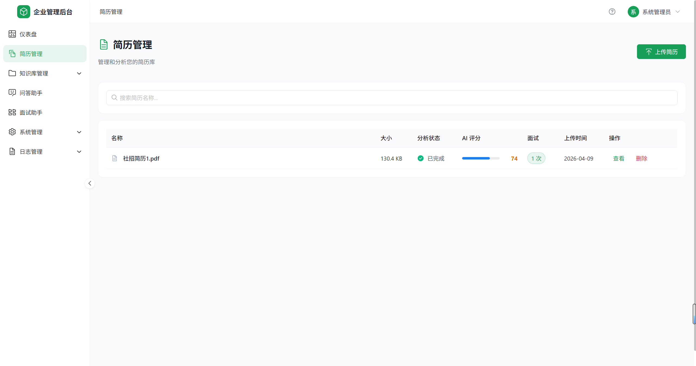
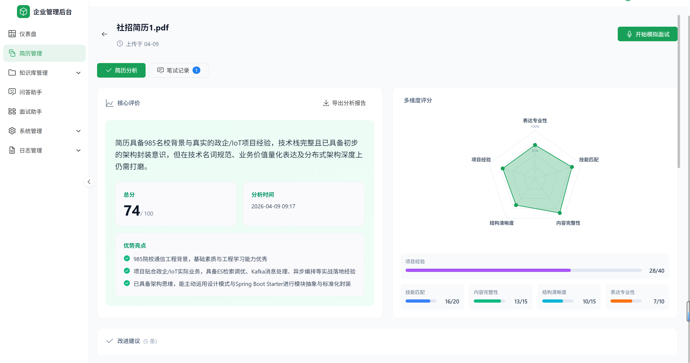
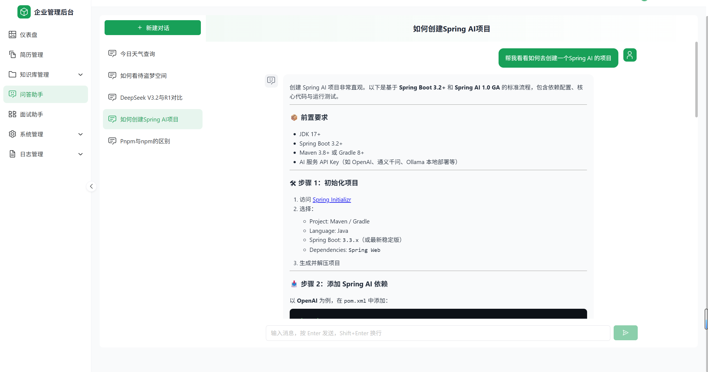
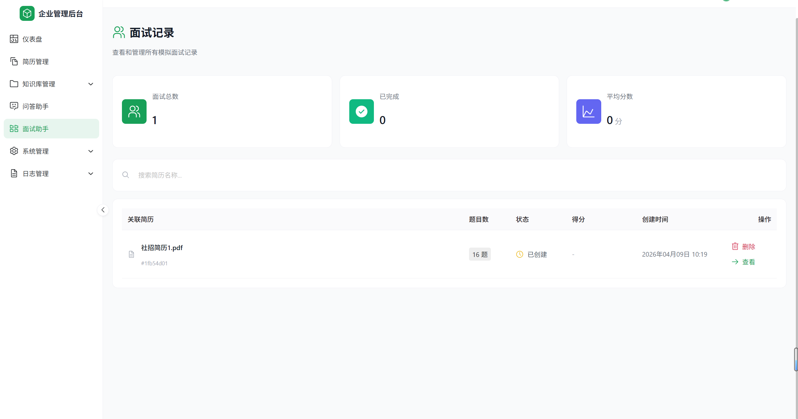

# Daliymove - AI 驱动的企业级面试管理平台

基于 Spring Boot 3 + Vue 3 构建的智能化面试管理系统，集成 AI 简历分析、模拟面试、知识库问答等功能。

## 核心功能

### AI 驱动功能
- **简历智能分析** - AI 自动解析简历，提取关键信息，生成能力雷达图
- **模拟面试助手** - 基于简历智能生成面试题目，支持实时对话式面试
- **知识库问答** - RAG 技术驱动的企业知识库，支持文档上传和智能问答
- **AI 个人助手** - 通用 AI 对话助手，支持多模型切换

### 企业管理功能
- **RBAC 权限模型** - 用户、角色、权限、菜单四级权限控制
- **部门管理** - 支持树形组织架构
- **操作日志** - 完整的系统操作审计

## 技术栈

### 后端
| 技术 | 版本 | 说明 |
|------|------|------|
| Spring Boot | 3.5.0 | 基础框架 |
| Sa-Token | 1.37.0 | JWT 认证授权 |
| MyBatis-Plus | 3.5.5 | ORM 框架 |
| Spring AI | 1.1.0 | AI 能力集成 |
| MySQL | 8.0 | 主数据库 |
| Redis | 6.0+ | 缓存/Session |
| SpringDoc | 2.8.6 | API 文档 |
| iText | 8.0.5 | PDF 处理 |

### 前端
| 技术 | 版本 | 说明 |
|------|------|------|
| Vue | 3.4 | 渐进式框架 |
| TypeScript | 5.3 | 类型系统 |
| Naive UI | 2.37 | UI 组件库 |
| Pinia | 2.1 | 状态管理 |
| Vue Router | 4.2 | 路由管理 |
| UnoCSS | 66.6 | 原子化 CSS |
| Axios | 1.6 | HTTP 客户端 |
| Vite | 5.0 | 构建工具 |

## 项目结构

```
interview-daliymove/
├── backend/                           # 后端项目
│   ├── daliymove-common/              # 通用模块
│   │   └── src/main/java/com/daliymove/common/
│   │       ├── annotation/            # 自定义注解
│   │       ├── domain/                # 领域对象
│   │       ├── dto/                   # 数据传输对象
│   │       ├── exception/             # 异常处理
│   │       └── response/              # 统一响应对象
│   ├── daliymove-system/              # 系统模块
│   │   └── src/main/java/com/daliymove/system/
│   │       ├── aspect/                # AOP 切面
│   │       ├── config/                # 配置类
│   │       ├── controller/            # 控制器
│   │       ├── dto/                   # 数据传输对象
│   │       ├── entity/                # 实体类
│   │       ├── mapper/                # Mapper 接口
│   │       ├── service/               # 业务逻辑
│   │       └── vo/                    # 视图对象
│   ├── daliymove-modules/             # 业务模块
│   │   └── src/main/java/com/daliymove/modules/
│   │       ├── chat/                  # AI 聊天助手
│   │       ├── resume/                # 简历管理
│   │       ├── interview/             # 面试助手
│   │       ├── knowledge/             # 知识库管理
│   │       ├── file/                  # 文件管理
│   │       └── export/                # 导出功能
│   ├── daliymove-server/              # 启动模块
│   │   └── src/main/
│   │       ├── java/                  # 启动类
│   │       └── resources/
│   │           ├── application.yml    # 配置文件
│   │           └── mapper/            # XML 映射文件
│   └── sql/                           # 数据库脚本
│       └── init.sql                   # 初始化脚本
├── frontend/                          # 前端项目
│   ├── src/
│   │   ├── api/                       # API 接口封装
│   │   │   ├── resume.ts              # 简历接口
│   │   │   ├── interview.ts           # 面试接口
│   │   │   ├── knowledgebase.ts       # 知识库接口
│   │   │   └── ragChat.ts             # RAG 问答接口
│   │   ├── components/                # 公共组件
│   │   │   ├── resume/                # 简历相关组件
│   │   │   │   ├── AnalysisPanel.vue  # 分析面板
│   │   │   │   ├── RadarChart.vue     # 雷达图
│   │   │   │   └── HistoryList.vue    # 历史列表
│   │   │   └── interview/             # 面试相关组件
│   │   │       ├── InterviewChatPanel.vue
│   │   │       ├── InterviewConfigPanel.vue
│   │   │       └── InterviewDetailPanel.vue
│   │   ├── composables/               # 组合式函数
│   │   ├── layouts/                   # 布局组件
│   │   ├── router/                    # 路由配置
│   │   ├── stores/                    # Pinia 状态管理
│   │   ├── types/                     # TypeScript 类型定义
│   │   ├── utils/                     # 工具函数
│   │   └── views/                     # 页面组件
│   │       ├── dashboard/            # 仪表盘
│   │       ├── resume/                # 简历管理
│   │       │   ├── index.vue         # 简历列表
│   │       │   ├── Upload.vue        # 上传页面
│   │       │   └── Detail.vue       # 详情页面
│   │       ├── interview/             # 面试助手
│   │       │   ├── index.vue         # 历史列表
│   │       │   └── Session.vue       # 面试会话
│   │       ├── assistant/             # AI 助手
│   │       ├── knowledge/             # 知识库管理
│   │       │   ├── index.vue         # 知识库列表
│   │       │   ├── Upload.vue        # 文档上传
│   │       │   └── Query.vue         # 知识问答
│   │       ├── system/               # 系统管理
│   │       │   ├── user/             # 用户管理
│   │       │   ├── role/             # 角色管理
│   │       │   ├── permission/       # 权限管理
│   │       │   ├── menu/             # 菜单管理
│   │       │   └── dept/             # 部门管理
│   │       ├── log/                  # 日志管理
│   │       ├── login/                # 登录页面
│   │       └── error/                # 错误页面
│   ├── vite.config.ts                # Vite 配置
│   ├── uno.config.ts                 # UnoCSS 配置
│   └── package.json
├── docs/                             # 项目文档
├── quiz/                             # 测验模块
└── README.md
```

## 模块说明

| 模块 | 说明 | 依赖 |
|------|------|------|
| daliymove-common | 通用基础模块：统一响应、异常处理、工具类、注解 | 无 |
| daliymove-system | 系统管理模块：用户鉴权、权限管理、菜单管理 | common |
| daliymove-modules | 业务模块：简历分析、面试助手、知识库、AI聊天 | system, common |
| daliymove-server | 启动模块：配置中心、应用入口 | system, modules, common |

## 快速开始

### 环境要求
- JDK 17+
- Node.js 18+
- MySQL 8.0+
- Redis 6.0+
- Maven 3.8+

### 后端启动

1. **创建数据库并导入初始数据**
```bash
mysql -u root -p < backend/sql/init.sql
```

2. **修改配置文件** `backend/daliymove-server/src/main/resources/application.yml`
```yaml
spring:
  datasource:
    url: jdbc:mysql://localhost:3306/enterprise_admin
    username: root
    password: your_password
  data:
    redis:
      host: localhost
      port: 6379
```

3. **配置 AI 服务**（可选）
```yaml
spring:
  ai:
    dashscope:  # 通义千问
      api-key: ${DASHSCOPE_API_KEY}
```

4. **启动后端服务**
```bash
cd backend
mvn spring-boot:run -pl daliymove-server
```

启动后访问：
- API 地址: http://localhost:8901/api
- API 文档: http://localhost:8901/api/doc.html

### 前端启动

1. **安装依赖**
```bash
cd frontend
pnpm install  # 或 npm install
```

2. **启动开发服务器**
```bash
pnpm dev  # 或 npm run dev
```

访问: http://localhost:3000

### 默认账号
- 用户名: `admin`
- 密码: `123456`

## 功能截图









### 简历分析

- 支持拖拽上传 PDF/Word 简历
- AI 自动解析个人信息、工作经历、技能标签
- 生成能力雷达图和改进建议

### 面试助手
- 根据简历自动生成面试题目
- 支持多种岗位类型（前端、后端、全栈等）
- 实时对话式模拟面试
- 自动记录面试历史

### 知识库管理
- 文档上传和管理
- RAG 智能问答
- 支持多种文档格式

## API 文档

启动后端后访问 SpringDoc OpenAPI: http://localhost:8901/api/doc.html

### 核心接口

| 模块 | 接口 | 方法 | 描述 |
|------|------|------|------|
| 认证 | /auth/login | POST | 用户登录 |
| 认证 | /auth/logout | POST | 用户登出 |
| 认证 | /auth/current | GET | 获取当前用户 |
| 简历 | /resume/upload | POST | 上传简历 |
| 简历 | /resume/analyze/{id} | POST | AI 分析简历 |
| 简历 | /resume/list | GET | 简历列表 |
| 面试 | /interview/session | POST | 创建面试会话 |
| 面试 | /interview/chat | POST | 面试对话 |
| 知识库 | /knowledge/upload | POST | 上传文档 |
| 知识库 | /knowledge/query | POST | RAG 问答 |
| 聊天 | /chat/conversation | POST | 创建对话 |
| 聊天 | /chat/message | POST | 发送消息 |

## 数据库设计

### 核心表结构

**系统模块**
- `sys_user` - 用户表
- `sys_role` - 角色表
- `sys_permission` - 权限表
- `sys_menu` - 菜单表
- `sys_user_role` - 用户角色关联表
- `sys_role_permission` - 角色权限关联表
- `sys_role_menu` - 角色菜单关联表
- `sys_dept` - 部门表
- `sys_operation_log` - 操作日志表

**业务模块**
- `resume` - 简历表
- `resume_analysis` - 简历分析记录表
- `interview_session` - 面试会话表
- `interview_answer` - 面试答案表
- `knowledge_base` - 知识库表
- `knowledge_document` - 知识文档表
- `chat_conversation` - 聊天会话表
- `chat_message` - 聊天消息表

## 项目构建

### 后端构建
```bash
cd backend
mvn clean package -DskipTests
java -jar daliymove-server/target/daliymove-server-1.0.0.jar
```

### 前端构建
```bash
cd frontend
pnpm build  # 或 npm run build
# 构建产物在 dist/ 目录
```

## 开发规范

详见 [AGENTS.md](./AGENTS.md)

### 后端规范
- 遵循阿里巴巴 Java 开发规范
- Controller 层只负责请求响应
- Service 层处理业务逻辑
- Mapper 层只做数据库操作
- 使用 `@Transactional` 标记事务方法
- **必须添加必要的代码注释**

### 前端规范
- 使用 TypeScript 强类型
- 组件使用 `<script setup>` 语法
- 使用 Pinia 进行状态管理
- API 统一放在 `src/api/` 目录
- 使用 UnoCSS 原子化 CSS
- **必须添加必要的代码注释**

## 相关文档

- [路由和菜单配置说明](./ROUTE_MENU_CONFIG.md)
- [AI 助手技术栈分析](./daliymoveNote/SSE流式问答助手技术栈分析.md)

## License

MIT License